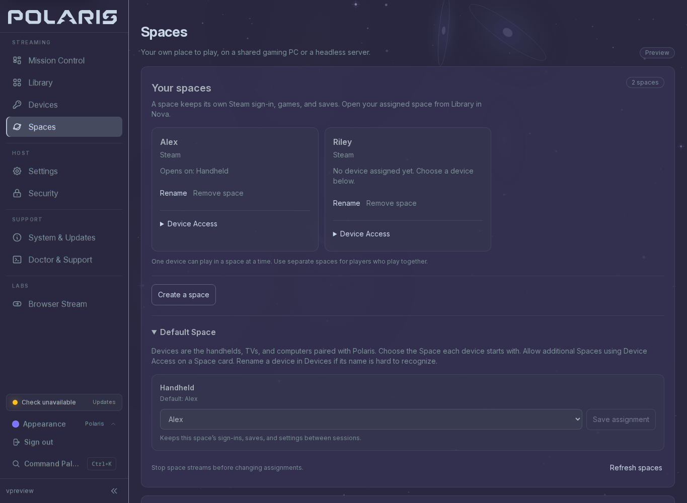

# Spaces

A Space is a separate Steam sign-in, game library and set of saves on one Linux
gaming PC. Two players can use their own Spaces at the same time, one person
can keep a Space on a server without a monitor, or a handheld and a TV can share
one Space at different times.

Spaces are a preview. Two limits shape everything below: the host runs one
Space at a time, and the gaming runtime is not published for download yet, so
the catalog in **Host Setup** stays empty until it is.

Spaces are optional. If you stream your usual desktop and games today, keep
using the Library in Nova; nothing here is required for that, and you do not
need Docker. [Spaces or regular streaming](spaces-or-regular.md) puts the two
side by side.



Example with sample player and device names.

## What you need

| Component | Purpose |
| --- | --- |
| Polaris RPM, Arch package or DEB | Runs the host, pairing, settings and streaming |
| Docker Engine on that host | Runs the isolated gaming environments |
| Polaris gaming runtime image | Steam and the software that runs inside each Space, downloaded by Docker from GitHub Container Registry |
| Nova on your device | Opens the stream and sends your controls |

Steam, its 32-bit libraries and the gaming userspace live inside the runtime
image, so the host does not need Steam installed. The host still needs Polaris,
Docker, its GPU driver and input permissions. An NVIDIA image names the host
driver version it was built for; the current preview image targets NVIDIA
610.57.04.

The native packages ship the setup UI, the controller, the host policy files
and the `polaris-spaces-setup` helper. There is no supported image that runs
the whole Polaris host inside Docker, and no Unraid template.

## Host Setup

Open **Spaces** in the Polaris console, beside **Devices**, and expand **Host
Setup**. It runs seven checks on the PC hosting Polaris, whichever device you
opened the page from, and each failing check links the section of this guide
that fixes it. Select **Recheck Setup** after every terminal step. A configured
host keeps the section collapsed.

## Prepare Docker from Spaces

1. If **Docker Engine** needs attention, install it with your distribution's
   steps below, in a terminal on the Polaris host.
2. Start the system Docker service, then grant Docker access to the Linux
   account running Polaris. For a service installation that account may differ
   from your terminal account; grant it to the service account.
3. Save your work and stop streams before signing out and back in. If Polaris
   runs as a system service, restart that service so it picks up the new group.
4. Select **Recheck Setup**.

Docker group access gives that account administrator-level control over the
host. Grant it only to a trusted account; Docker's
[post-installation instructions](https://docs.docker.com/engine/install/linux-postinstall/)
explain why.

If **Docker Engine** passes but **Polaris access to Docker** fails, confirm that
the system daemon is running and that the Polaris process received the new
group membership. Docker Desktop, remote Docker contexts and rootless Docker
are not the supported engine in this preview.

### Fedora

```sh
sudo dnf config-manager addrepo --from-repofile https://download.docker.com/linux/fedora/docker-ce.repo
sudo dnf install docker-ce docker-ce-cli containerd.io docker-buildx-plugin docker-compose-plugin
sudo systemctl enable --now docker
```

If you already have a container engine or hit a package conflict, read the
[Docker Fedora guide](https://docs.docker.com/engine/install/fedora/) before
replacing packages. Spaces never removes existing container software.

### Arch Linux

```sh
sudo pacman -Syu docker
```

If the update installed a new kernel, save your work and restart the host
before starting Docker; signing out alone does not load the new kernel, and
Docker can fail to start when the running kernel no longer has its network
modules. Then:

```sh
sudo systemctl enable --now docker
```

The [Arch Docker documentation](https://wiki.archlinux.org/title/Docker) covers
distribution-specific configuration.

### Ubuntu

Follow the [Docker Ubuntu guide](https://docs.docker.com/engine/install/ubuntu/)
to add Docker's repository key and package repository, then install the engine.
Return to Spaces and select **Recheck Setup**.

### Bazzite, SteamOS and other system images

The package commands above do not apply, and the preview does not automate
Docker on these systems. Use your distribution's supported installation method,
and do not disable filesystem protection to follow instructions written for
another distribution.

## Gaming runtime account

The current runtime requires the Linux account running Polaris to have user and
group ID 1000, which is the first account created on most installations. The
**Gaming runtime account** check says whether this host qualifies.

Do not change an existing account's ID to work around this; it breaks file
ownership across the whole account. Run Polaris under an account that already
has that ID, or wait for a runtime that lifts the limit.

## Controller access

Polaris creates virtual controllers, keyboards and mice for a Space through
`/dev/uinput` and `/dev/uhid`. When **Controller and input access** fails,
run the host setup that grants them:

```sh
sudo -H polaris --setup-host
```

then restart Polaris and select **Recheck Setup**. **Doctor & Support** shows
the same access with its reason.

## Graphics access

A Space needs a render node the Polaris account can open. When **Graphics
device access** fails, check that the GPU driver is installed and that the
account is in the group that owns `/dev/dri/renderD*` (usually `render` or
`video`); **Doctor & Support** names the node it tried. Hardware encoding is
checked again when the Space starts.

## Prepare Spaces security support

On hosts with SELinux, the **Spaces security support** check verifies that
SELinux is enforcing and that the dedicated policies and input rule are
installed at the matching version. Hosts without SELinux need only the Steam
seccomp file, which the native package includes.

On a mutable Fedora installation:

1. Install the tools that compile against your host policy:
   ```sh
   sudo dnf install selinux-policy-devel container-selinux make
   ```
2. Finish your games, stop Space streams and quit Polaris. If it runs as a
   service, stop the service first.
3. Run the helper from the native package:
   ```sh
   sudo -H /usr/bin/polaris-spaces-setup install
   ```
4. Start Polaris, return to **Spaces** and select **Recheck Setup**.

The helper installs the worker policy, the reserved controller policy, a
version marker and the reserved input rule. It reloads policy and udev rules
without changing enforcement or relabeling controllers, and it does not
install Steam, change drivers, start Docker or restart Polaris. If it is
interrupted, run the same command again. Policies you installed by hand, or an
input rule with no ownership record, are reported for review rather than
replaced.

If the helper refuses, its message names the situation:

- **"An existing Spaces policy is disabled, overridden or locally managed."** A
  module with one of the helper's names is installed at another priority, for
  example a copy installed by hand. `sudo semodule -lfull | grep polaris` shows
  it with its priority. Remove that copy, for example
  `sudo semodule -X 400 -r polaris_multiseat_input polaris_nvidia_worker`, then
  run the install again. libsemanage may print "Failed!" while removing; trust
  the list, not the message.
- **"Quit Polaris and stop Spaces streams before changing security setup."** A
  process named `polaris` or `polaris-something` is still running, a second
  instance included. `pgrep -a polaris` names it; stop it and retry.
- **"Existing Spaces input rule is not owned by this setup."**
  `/etc/udev/rules.d/97-polaris-multiseat-input.rules` was placed there by hand,
  so the helper has no record of it. Move it aside and run the install again;
  the helper writes and records its own copy.

`polaris-spaces-setup status` shows readiness. `sudo -H /usr/bin/polaris-spaces-setup remove`
removes only what the helper owns, after Polaris and every Space have stopped;
it never deletes player homes. Remove the policies before uninstalling the
package if you no longer need them: package removal alone leaves them installed with
nothing left to remove them, and [Uninstall Polaris, or start over](uninstall.md)
has the full order. Package installation and removal never
change live SELinux policy. Other SELinux distributions need the compatible
development interfaces and the container reference policy; system images are
not supported by the helper in the preview.

## Prepare your first Space

Once the host checks pass and a runtime is offered:

1. Under **Set up your first space**, enter a name such as **Living room**.
   If more than one runtime is offered, choose the variant for your graphics
   hardware; an NVIDIA variant names the host driver it needs.
2. Select **Download and prepare**. The download is several gigabytes. You can
   leave Spaces and come back; the host keeps the job. Polaris cannot show a
   percentage for it.
3. **Stop setup** is available while the runtime downloads; Docker keeps
   verified layers for the next attempt. Once Steam home preparation begins,
   wait for it to finish.
4. When the home is prepared, choose its **Graphics card** and select **Enable
   Spaces**. Polaris saves its configuration without starting a game. This
   first setup allows one Space at a time; hosts configured by hand keep their
   own budget.
5. Save any running game, then select **Restart Polaris and finish setup**.
   Restarting disconnects every stream. Reconnect and return to **Spaces**.
6. Under **Default Space**, assign your paired Nova device to the new Space.

**Steam home prepared** means storage was saved. **Configuration saved** means
a restart is still required. Neither is a game or controller test yet; that
comes in [Play in a Space](#play-in-a-space).

## Recover an interrupted setup

- **Reconnect to setup** re-reads the job without changing it. Use it first
  after a dropped connection.
- **Retry setup** checks the original request and its saved home. It never
  creates a second home or copies another player's Steam sign-in.
- If Polaris restarts, the job does not resume on its own. Return to Spaces
  and retry it.
- If the runtime you started with is no longer offered by this build, the job
  cannot be retried; your player data stays where it is.
- If the setup journal could not be secured, Spaces shows **recovery
  required** and names the retained image and reference. Polaris keeps
  uncertain resources for recovery instead of deleting or adopting them.
  Restart Polaris after saving your work; if it persists, open **Doctor &
  Support** and keep the existing player data while diagnosing.
- If no accessible graphics card matches the runtime, the prepared home waits.
  Fix [graphics access](#graphics-access) and recheck.

Configuration is retried with the same graphics selection. A changed or
inaccessible GPU needs attention; Polaris does not silently choose another.

## Add a Space on a configured host

1. Stop every Space stream. Creating, renaming, removing or restoring a Space
   and changing any device's access all reload the host's Space catalog, so
   they wait for the streams to end.
2. Select **Create a space** and give it a recognisable name, a player or a
   room.
3. If asked, choose an existing Steam setup. The new Space reuses its runtime
   configuration and gets its own storage and no copied sign-in.
4. Wait for the creation to be confirmed. After a dropped connection use
   **Check creation status** or **Retry creation**; both check the same
   request. Returning to Spaces in the same browser tab restores an unfinished
   request without submitting it again.
5. Give a device access, below, then refresh the library in Nova.

## Give a device access

- **Default Space** on the Spaces page lists the handhelds, TVs and computers
  paired with Polaris. Choose the Space each device opens first and select
  **Save assignment**. Devices assigned to the same Space share its sign-in and
  saves and take turns streaming it; give simultaneous players separate Spaces
  and separate Steam accounts.
- **Device Access** on a Space card allows more devices into that Space. A
  device with more than one permitted Space picks between them in Nova with
  **Change Space**.
- **Desktop** is this PC's usual desktop and apps. Under Default Space it
  clears all of a device's Space access; under **Desktop Access** it becomes
  one more choice beside the device's Spaces.
- A device needs permission to launch apps; temporary guests cannot be
  assigned a Space. Rename an unfamiliar device in **Devices**.

Spaces do not change
[Steam's account and library sharing rules](https://help.steampowered.com/en/faqs/view/054C-3167-DD7F-49D4).

## Play in a Space

1. Open the host in Nova. **Playing in** in the library toolbar names your
   Space; **Change Space** lists the others this device may use. With one
   permitted Space the library opens straight into it, and the host remembers
   each device's last choice.
2. Select **Steam Big Picture**, sign in and install a game. A Space's name is
   a label, not proof of which Steam account is signed in; check or switch the
   account inside Steam.
3. Return to the library and refresh it; a newly installed title can take up
   to 15 seconds to appear. Choose a game and press **Play**. Start at 60 FPS,
   check picture, sound and both sticks, then raise the target.

Each Space shows a status: ready, starting, playing (yours), in use (another
device), stopping, or unavailable when the host cannot offer it. A Space that
reads ready but cannot open because the host is at its limit says so before
you press, and a refused launch tells you what to change.

**Save before you leave.** In this preview, disconnecting ends the Space's
running game. **Leave Space** asks you to confirm and keeps saves, installed
games and the Steam sign-in; a dropped connection ends the session the same
way. **Resume** is offered only for a session this device owns and does not
promise a disconnected game kept running. Other Spaces keep running.

Nova's **Play Setup** saves resolution and frame rate on the device for the
next Space launch. Nova offers up to 240 FPS where the display supports it; a
selected rate is a target the host must sustain with every intended Space
running, so start at 60 and raise it. Switching a streaming preset never
switches accounts or Spaces.

## Rename, remove and restore

**Rename** on a Space card changes its name without touching its account or
files; refresh the library in Nova afterwards. **Remove Space** archives it
after a confirmation: devices lose access, other Spaces stay available, and
installed games, saves, settings and the sign-in stay on the host. It frees no
disk space and deletes no Docker volume. **Restore** under **Archived Spaces**
brings it back without its device access; assign devices again.

## Check sound and stuttering

If sound crackles or drops, note the time, the Space, the game, the frame rate,
the bitrate and whether the device is on Wi-Fi or Ethernet, and whether picture
or controls paused too. Compare the same game over Ethernet or another access
point, with downloads and builds paused on the host, changing one thing at a
time, and compare one Space with the intended number of players. Low latency
and zero reported packet loss do not rule out brief audio pauses; the preview
has recorded both host scheduling stalls and wireless delays. Keep the notes
for **Doctor & Support**.

## When something goes wrong

- A refused launch in Nova names the reason and the fix: the Space is in use
  on another device, this device already has a Space running, every Space
  slot or the encoder is taken, no Space is assigned or selected, or the
  assignment changed. Do what it says, then try again.
- A failing host check links its section above. **Doctor & Support** covers
  controller and graphics access with the host's own evidence.
- If a Space stops on its own or loses sound, keep the time and the Space name
  for diagnosis. A passing setup check does not prove that 120 FPS, every
  game or every GPU is reliable.
- Keep SELinux enabled, and do not add privileged container flags or mount
  the whole device tree.

## Preview limits

One Space at a time, no runtime download until an image is published, handheld
audio still under investigation, NVIDIA exercised and AMD not yet, Docker on
system images not automated. The measured results and the exact boundaries are
in the [preview status report](research/container-multiseat-preview-status.md),
which links the acceptance and audio reports it summarises.
